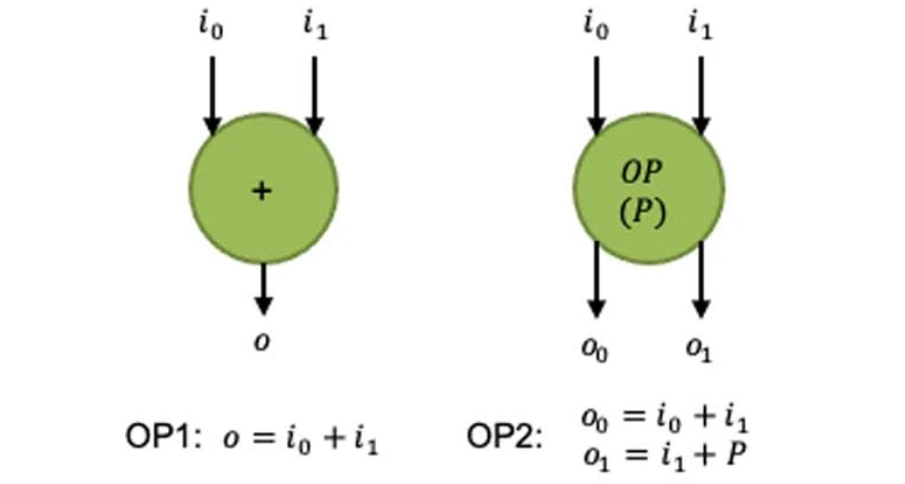
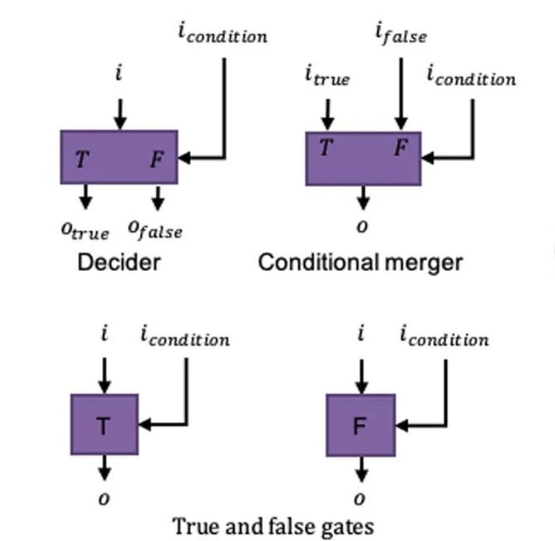
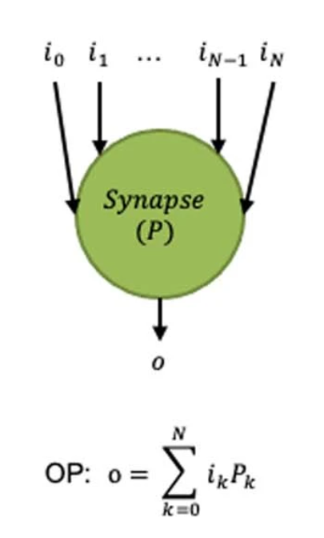
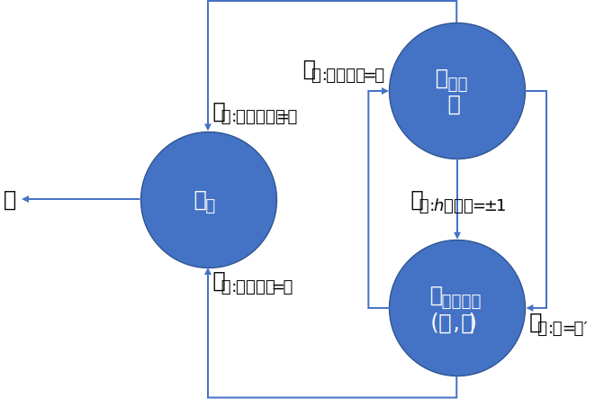

# 《A system hierarchy for brain-inspired computing》笔记一：类脑计算完备性和POG

## 通用逼近器(Universal Approximator)和通用逼近理论(Universal Approximation Theorem)

通用逼近理论：对于足够大的、由两层的神经网络和一个ReLU非线性层组成的网络（即$y=ReLU(\bm w^Tx+b,0)$），可以通过合理设定参数矩阵来近似所有的连续函数或者各种其他函数 [Hornik et al., 1989, Cybenko, 1992,Barron, 1993]。

对比高等数学在讲无穷级数之前引入的Stone-Weierstrass第一定理：
* 闭区间上的连续函数可用多项式级数一致逼近

和讲傅里叶级数之前引入的Stone-Weierstrass第二定理：
* 闭区间上周期为$2\pi$的连续函数可用三角函数级数一致逼近

它们分别证明了多项式函数和三角函数在函数空间内的稠密性；而通用逼近理论则证明了类似ReLU的阶梯函数在函数空间内的稠密性。基于这种稠密性构建的通用逼近器计算式$y=ReLU(\bm w^Tx+b)$就是现在所有神经网络的基础。

## Neuromorphic Computing Capability 类脑计算能力

通用逼近器$y=ReLU(\bm w^Tx+b)$的核心目标是“逼近”，它的计算能力由它的逼近精度决定。

若存在两个可以生成函数的系统$A$和$B$，将$A$能生成的所有函数的集合记为$S_A$、将$B$能生成的所有函数的集合记为$S_B$，即：
$$
\begin{aligned}
S_A&=\{f(x)|f(x)\text{是由}A\text{产生的函数}\}\\
S_B&=\{f(x)|f(x)\text{是由}B\text{产生的函数}\}
\end{aligned}
$$

若以$D(f)$表示函数的定义域，则类脑计算的计算能力可以表述为：

$$
A\text{系统的类脑计算能力等于或强于}B\text{系统}:=(\forall\varepsilon\ge0)(\forall f_A\in S_A)(\exist f_B\in S_B)(\forall x\in D(f_A))||f_A(x)-f_B(x)||\le\varepsilon
$$

## Neuromorphic Complete 类脑计算完备性

$$A\text{系统是类脑计算完备的}:=A\text{系统的类脑计算能力等于或强于图灵完备系统}$$

### 图灵完备系统和通用逼近器的类脑计算完备性

* 证明图灵完备系统是类脑计算完备的：
  * 图灵完备系统的系统的类脑计算能力等于它自身
  * 因此图灵完备系统是类脑计算完备的
* 证明通用逼近器是类脑计算完备的：
  * 图灵完备系统所能生成的函数是图灵可计算函数
  * 通用逼近器生成的函数能以任意精度逼近任意函数
  * 通用逼近器生成的函数能以任意精度逼近图灵可计算函数
  * 通用逼近器的类脑计算能力大于或等于图灵完备系统
  * 因此通用逼近器是类脑计算完备的

### 图灵完备系统和通用逼近器的可组合性

>In computer science, function composition is an act or mechanism to combine simple functions to build more complicated ones. Like the usual composition of functions in mathematics, the result of each function is passed as the argument of the next, and the result of the last one is the result of the whole. ——Wikipedia

可组合性是指将两个简单的函数$f(x)$、$g(x)$组合成$f(g(x))$就能表示更加复杂的函数的过程。

对于图灵可计算函数的组合相当于将一个图灵机停机后的字符串作为另一个图灵机开始的字符串，这样的组合可以产生更加复杂的函数（相当于增加了图灵机的规则，使图灵机的计算能力更强）。

而对于通用逼近器，想要逼近更加复杂的函数或提高逼近的精度，则需要增加层中的神经元数量（即在$y=ReLU(\bm w^Tx+b)$中扩展$w$的长度）；而$f(g(x))$是增加了神经网络的层数。因此，通用逼近器组合无法产生更加复杂的函数，不具备可组合性。

## Programming Operator Graph (POG)

### FSOG(Finite State Operator Graph, 有限状态操作图)形式定义

FSOG为一个五元组$\psi$：

$$\psi=(G, T, \delta, q_0, F)$$

* $G$：操作图，$G=(V,E)$
  * 边$e_{v_1,v_2}\in E$表示Operator $v_1$的一个或多个数据事件需要传递给$v_2$，也可以看作是$v_1$和$v_2$间的数据依赖关系
  * 点$v\in V$表示一个Operator，当$v$和其他所有点的依赖关系被满足时，就可以开始计算
* $T$：事件集合
  * 数据事件$t_{d:i=v}\in T$：用于传输计算所需的输入数据，$v$表示一个字符串
  * 触发事件$t_s\in T$：不包含数据，仅用于表征Operator间的依赖关系
* $\delta$：状态转移函数，$\delta:2^{T\times E}\rightarrow2^{T\times E}$
* $q_0$：初始状态，$q_0\in2^{T\times E}$
* $F$：终结状态集（接受状态集），$F\subseteq 2^{T\times E}$

#### FSOG的瞬时描述（状态详解）

按照自动机理论的一般视角，FSOG的有限状态集$Q=2^{T\times E}$，其中的每一个状态（也即瞬时描述）：

$$q=\{(t,e)|t\in T\wedge e\in E\}\in Q$$

表示一系列事件与操作图中边的对应关系，状态中的对应关系$(t,e_{v_1,v_2})\in q$表示事件$t$在边$e_{v_1,v_2}$上被触发了，也同时表明$v_1$和$v_2$之间执行的依赖关系已经满足。

#### 定义FSOG的动作（状态转移函数详解）

FSOG状态转移函数可以看作是操作图中所有Operator的状态转移函数的集合：

$$\delta=\{f_v|f_v:2^{T\times \{e_{v_i,v}\in E|v_i\in V\}}\rightarrow 2^{T\times \{e_{v,v_o}\in E|v_o\in V\}},v\in V\}$$

其中每个Operator $v$的状态转移函数$f_v$就是一个输入边上的状态（事件-边元组的集合）$I_v\subseteq T\times \{e_{v_i,v}\in E|v_i\in V\}$到输出边上的状态$O_v\subseteq T\times \{e_{v,v_o}\in E|v_o\in V\}$的映射$O_v=f_v(I_v)$。由于$f_v$是离散的状态转移函数，因此它也可以看成是一系列状态转移规则的集合$\Delta_v$：

$$\Delta_v=\left\{I_v\rightarrow O_v|O_v=f_v(I_v)\right\}$$

在状态转移过程中，只有所有输入条件全部满足（即每个相连的输入边上都有事件触发）的Operator才能进行状态转移，这些Operator称为“使能”的Operator。在某个状态$q$中所有使能Operator的集合可以表示为：

$$V_{enabled}(q)=\{v|(\forall v_i\in V\wedge e_{v_i,v}\in E)(\exist t\in T)(t,e_{v_i,v})\in q\}$$

进而可以将状态转移函数$\delta$表达为：

$$
\delta(q)=\bigcup_{v\in V_{enabled}(q)}f_v\left(\{(t,e_{v_i,v})|v_i\in V\wedge(t,e_{v_i,v})\in q\}\right)
$$

## POG 扩展操作

除上文所述的 POG 的状态转移操作外，POG 还提供了一些扩展操作，这些操作可以由基本操作组合而来，因此包含这些扩展操作的POG与原始POG是等价的。

使用 POG 扩展操作可以帮助开发人员更快速有效地构造 POG。

### 带参数更新器(Parameter Updater)的POG

带参数更新器的FSOG为一个五元组$\psi$：

$$\psi=(G, T, \delta, q_0, F)$$

* $G$：操作图，$G=(V,E,P)$
  * 点$v\in V$和边$e_{v_1,v_2}\in E$含义同上
  * $P$是Operator的参数列表，$v$的参数$P[v]$表示一个只有Operator $v$才能访问和修改的符号串
    * 设$P$所有可能的取值情况集合为$\mathcal P$，$P\in\mathcal P$
    * 设参数符号集为$\Sigma_P$，$P[v]\in\Sigma_P^*$
* $T$：事件集合
  * 数据事件$t_{d:i=v}$含义同上
  * 参数更新事件$t_{u:p=x}$表示将该边所连接的点的参数修改为$x$
* $\delta$：状态转移函数，$\delta:2^{T\times E}\times \mathcal P\rightarrow2^{T\times E}\times \mathcal P$
* $q_0$：初始状态，$q_0\in2^{T\times E}\times \mathcal P$
* $F$：终结状态集（接受状态集），$F\subseteq2^{T\times E}\times \mathcal P$

#### 带参数更新器的FSOG的瞬时描述（状态详解）

显然，加入参数更新器后，每个Operator都是有状态的了，每个Operator与一个状态对应，表示为一个二元组$(v,p)\in \mathcal P$，进而FSOG的状态可以表示为：
$$q=2^{T\times E}\times\mathcal P$$

#### 定义带参数更新器的FSOG的动作（状态转移函数详解）

加入参数更新器后，状态转移函数不仅需要更新边上触发的事件，还需要更新Operator中的状态符号串，因此Operator状态转移函数的集合定义为：

$$\delta=\{f_v|f_v:2^{T\times \{e_{v_i,v}\in E|v_i\in V\}}\times \Sigma_P^*\rightarrow 2^{T\times \{e_{v,v_o}\in E|v_o\in V\}}\times \Sigma_P^*,v\in V\}$$

同理，其中的$f_v$可以看成是转移规则的集合$\Delta_v$：

$$\Delta_v=\left\{(I_v,p)\rightarrow(O_v,p')|(O_v,p')=f_v(I_v,p)\right\}$$

使能Operator的集合$V_{enabled}(q)$的定义不变，状态转移函数$\delta$表达为：

$$
\begin{aligned}
\delta(q)&=(\bigcup_{v\in V_{enabled}(q)}q_{t,e}(v),P')\qquad\text{其中，}\\
(q_{t,e}(v),P'[v])&=f_v\left(\{(t,e_{v_i,v})|v_i\in V\wedge(t,e_{v_i,v})\in q\},P[v]\right)\\
\end{aligned}
$$

#### 证明包含参数更新器的POG与原始POG等价

可以使用仅包含状态转移操作的Operator $v$模拟具有参数更新器的Operator：

* $v$有一条指向自身的边$e_{v,v}$，将需要更新的参数作为数据事件$t_{d:i=x}$其上传递
* $v$有一条用于更新参数的状态转移规则：
$$\{(t_{u:p=x},e_{v',v}),(t_{d:i=p},e_{v,v})\}\rightarrow\{(t_{d:i=x},e_{v,v})\}\in\Delta_v$$

其中，$v'$是通过$e_{v',v}$向$v$发送参数更新事件的Operator。

显然，此Operator $v$等价于一个带有参数更新器的Operator。因此包含参数更新器的POG与原始POG等价。

### Control-Flow Operator 流程控制Operator

流程控制Operator是用于模拟一般编程语言中的IF操作，它包三种Operator：Decider、Conditional Merger和True/False gates

#### Decider

Decider根据情况选择将输入的数据输出到哪条边。它有两条输入边和两条输出边：
* 输入边$e_{v_i,v}$用于接收数据
* 输入边$e_{v_{c},v}$用于接收$True/False$
* 当$e_{v_{c},v}$收到事件$t_{d:condition=True}$时，将收到的数据输出到输出边$e_{v,v_t}$
* 当$e_{v_{c},v}$收到事件$t_{d:condition=False}$时，将收到的数据输出到输出边$e_{v,v_f}$

使用基础Operator模拟Decider时，其状态转移规则形式化表述为：

$$
\Delta_v=
\left\{\begin{aligned}
  \{(t_{d:i=x},e_{v_i,v}),(t_{d:condition=True},e_{v_c,v})\}&\rightarrow\{(t_{d:i=x},e_{v,v_t}),(t_s,e_{v,v_f})\},\\
  \{(t_{d:i=x},e_{v_i,v}),(t_{d:condition=False},e_{v_c,v})\}&\rightarrow\{(t_s,e_{v,v_t}),(t_{d:i=x},e_{v,v_f})\}\\
\end{aligned}
\right\}
$$

#### Conditional Merger

Conditional Merger根据情况选择将哪条边的输入数据输出到输出边。它有三条输入边和一条输出边：
* 输入边$e_{v_t,v}$、$e_{v_f,v}$用于接收数据
* 输入边$e_{v_{c},v}$用于接收$True/False$
* 当$e_{v_{c},v}$收到事件$t_{d:condition=True}$时，将$e_{v_t,v}$收到的数据输出到输出边$e_{v,v_o}$
* 当$e_{v_{c},v}$收到事件$t_{d:condition=False}$时，将$e_{v_f,v}$收到的数据输出到输出边$e_{v,v_o}$

使用基础Operator模拟Conditional Merger时，其状态转移规则形式化表述为：

$$
\Delta_v=
\left\{\begin{aligned}
  \{(t_{d:i=x_t},e_{v_t,v}),(t_{d:i=x_f},e_{v_f,v}),(t_{d:condition=True},e_{v_c,v})\}&\rightarrow\{(t_{d:i=x_t},e_{v,v_o})\},\\
  \{(t_{d:i=x_t},e_{v_t,v}),(t_{d:i=x_f},e_{v_f,v}),(t_{d:condition=False},e_{v_c,v})\}&\rightarrow\{(t_{d:i=x_f},e_{v,v_o})\}\\
\end{aligned}
\right\}
$$

#### True/False gates

True/False gates根据情况选择是否让输入数据通过。它有两条输入边和一条输出边：
* 输入边$e_{v_i,v}$用于接收数据
* 输入边$e_{v_{c},v}$用于接收$True/False$
* 对于True gate：当$e_{v_i,v}$收到事件$t_{d:condition=True}$时，将收到的数据输出到输出边$e_{v,v_o}$，否则输出$t_s$
* 对于False gate：当$e_{v_i,v}$收到事件$t_{d:condition=False}$时，将收到的数据输出到输出边$e_{v,v_o}$，否则输出$t_s$

使用基础Operator模拟True gate时，其状态转移规则形式化表述为：

$$
\Delta_v=
\left\{\begin{aligned}
  \{(t_{d:i=x},e_{v_i,v}),(t_{d:condition=True},e_{v_c,v})\}&\rightarrow\{(t_{d:i=x},e_{v,v_o})\},\\
  \{(t_{d:i=x},e_{v_i,v}),(t_{d:condition=False},e_{v_c,v})\}&\rightarrow\{(t_s,e_{v,v_o})\}\\
\end{aligned}
\right\}
$$

使用基础Operator模拟False gate时，其状态转移规则形式化表述为：

$$
\Delta_v=
\left\{\begin{aligned}
  \{(t_{d:i=x},e_{v_i,v}),(t_{d:condition=True},e_{v_c,v})\}&\rightarrow\{(t_s,e_{v,v_o})\},\\
  \{(t_{d:i=x},e_{v_i,v}),(t_{d:condition=False},e_{v_c,v})\}&\rightarrow\{(t_{d:i=x},e_{v,v_o})\}\\
\end{aligned}
\right\}
$$

### Synapse 突触操作器

>In POG, typical operators are enabled when all the input tokens are satisfied. But in most neuromorphic models, the neuron may have input connections from many other neurons and its internal states should be updated every time a spike arrives.

因此，为了更好地表示这些操作，我们需要一个能执行类似操作的Operator，称为Synapse：
* Synapse $v$有$n$个输入边$e_{v_i,v},i\in[1,n]$
* Synapse是一个带参数更新器的Operator，其参数$P[v]$是一个长度等于输入边数量$n$的列表
* Synapse的输出为所有输入边的有效输入$t_{d:i=x_i}$的数据$x_i$与边对应参数$P[v]$的加权和

状态转移规则形式化表述为：

$$
\Delta_v=
\left\{
  \{(t_i,e_{v_i,v})|i\in[1,n],e_{v_i,v}\in E\}\rightarrow\{(t_{d:i=\sum_{i\in[1,n]}^{t_i\not = t_s}x_iP[v]_i},e_{v,v_o})\}
\right\}
$$

## Composability 可组合性

>As the operator of the POG may contain complicated instructions or even a whole algorithm, a sub-OG can be viewed as an operator.
>
>此功能称为可组合性，对于编程便利性很重要，因为不同的硬件实现可能会为硬件操作员提供多粒度的功能：可以将神经网络应用描述为
一个仅包含基本计算和控制流运算符的OG，然后将该OG的某些子图组成新的运算符，以适应多粒度硬件操作。 因此，描述为POG的应用程序可以不经修改就适合不同的硬件。
>
>从软硬件协同设计的角度来看，此属性也非常有用：我们可以根据底层硬件提供的特定操作来自定义编程操作员集，反之亦然。 由于可组合性，这些修改只能出现到POG级别，而不会影响上层编程范例。

## POG 图灵完备性

要证POG图灵完备性，只要构造一个模拟图灵机的POG即可：

其中各部分详解如下：

### 模拟图灵机输入带

使用一个带参数更新器的Operator $v_{tape}$模拟图灵机的输入带$T$，该Operator包含一个模拟输入带的无限长字符串$T$和记录读头位置的整数$i$：$P[v_{tape}]=(T,i),T\in\Gamma^*,i\in\mathbb Z$，其输入边有两个：
* $e_{v_{TM_{head}},v_{tape}}$上传递的事件为图灵机的读头位置移动方向$t_{d:head=m},m=\pm 1$。输入读头位置返回移动后对应位置处的参数值$T_i$
* $e_{v_{TM_{update}},v_{tape}}$上传递的事件为更新图灵机输入带上当前位置的值$t_{u:p=c}$。输入当前参数的修改事件修改参数$T_i=c$

综合得其状态转移规则为：
$$
\left(\{(t_{d:head=m},e_{v_{TM_{head}},v_{tape}}),(t_{u:p=c},e_{v_{TM_{update}},v_{tape}})\},(T,i)\right)\rightarrow\left(\{(t_{d:data=T'_{i+m}},e_{v_{tape},v_{TM}})\},(T',i+m)\right)\text{其中}T'_{i}=c
$$

### 模拟图灵机

使用一个带参数更新器的Operator $v_{TM}$模拟图灵机，该Operator包含一个模拟状态的参数$P[v_{tape}]=q\in Q$，其输入边是与输入带Operator相连的$e_{v_{tape},v_{TM}}$，用于接收输入带上的值。其输出边就是控制输入带活动的$e_{v_{TM_{head}},v_{tape}}$和$e_{v_{TM_{update}},v_{tape}}$。

对于图灵机状态转移规则集合$\Delta$中的每个规则$(q,X)\rightarrow(q',X',D)$，都可以写出对应的POG状态转移规则：

$D=L$时：
$$
\left(\{(t_{d:data=X},e_{v_{tape},v_{TM}})\},q\right)\rightarrow\left(\{(t_{u:p=X'},e_{v_{TM_{update}},v_{tape}}),(t_{d:head=+1},e_{v_{TM_{head}},v_{tape}})\},q'\right)
$$
$D=R$时：
$$
\left(\{(t_{d:data=X},e_{v_{tape},v_{TM}})\},q\right)\rightarrow\left(\{(t_{u:p=X'},e_{v_{TM_{update}},v_{tape}}),(t_{d:head=-1},e_{v_{TM_{head}},v_{tape}})\},q'\right)
$$

### 接受状态

为了模拟接受状态$F$，还需要给$v_{tape}$和$v_{TM}$各加一条出边连到一个用于判断接受状态的Operator $v_F$中，如果$v_{TM}$进入接受状态，则输出$v_{tape}$中的参数$T$，否则不输出。因此有状态转移规则：

$$
\{(t_{d:state=q\in F},e_{v_{TM},v_{F}}),(t_{d:tape=T},e_{v_{tape},v_{F}})\}\rightarrow\{(t_{d:tape=T},e_o)\}
$$
