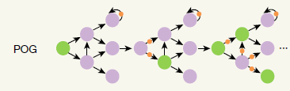
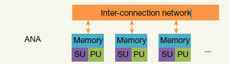

# A system hierarchy for brain-inspired computing

## 通用逼近器(Universal Approximator)和通用逼近理论(Universal Approximation Theorem)

通用逼近理论：对于足够大的、由两层的神经网络和一个Sigmoid非线性层组成的网络（即$y=Sigmoid(\bm w^Tx+b)$），可以通过合理设定参数矩阵来近似所有的连续函数或者各种其他函数 [Hornik et al., 1989, Cybenko, 1992,Barron, 1993]。

对比高等数学在讲无穷级数之前引入的Stone-Weierstrass第一定理：
* 闭区间上的连续函数可用多项式级数一致逼近

和讲傅里叶级数之前引入的Stone-Weierstrass第二定理：
* 闭区间上周期为$2\pi$的连续函数可用三角函数级数一致逼近

它们分别证明了多项式函数和三角函数在函数空间内的稠密性；而通用逼近理论则证明了类似Sigmoid的阶梯函数在函数空间内的稠密性。基于这种稠密性构建的通用逼近器计算式$y=Sigmoid(\bm w^Tx+b)$就是现在所有神经网络的基础。

## Neuromorphic Computing Capability 类脑计算能力

通用逼近器$y=Sigmoid(\bm w^Tx+b)$的核心目标是“逼近”，它的计算能力由它的逼近精度决定。

若存在两个可以生成函数的系统$A$和$B$，将$A$能生成的所有函数的集合记为$S_A$、将$B$能生成的所有函数的集合记为$S_B$，即：
$$
\begin{aligned}
S_A&=\{f(x)|f(x)\text{是由}A\text{产生的函数}\}\\
S_B&=\{f(x)|f(x)\text{是由}B\text{产生的函数}\}
\end{aligned}
$$

若以$D(f)$表示函数的定义域，则类脑计算的计算能力可以表述为：

$$
A\text{系统的类脑计算能力等于或强于}B\text{系统}:=(\forall\varepsilon\ge0)(\forall f_A\in S_A)(\exist f_B\in S_B)(\forall x\in D(f_A))||f_A(x)-f_B(x)||\le\varepsilon
$$

## Neuromorphic Complete 类脑计算完备性

$$A\text{系统是类脑计算完备的}:=A\text{系统的类脑计算能力等于或强于图灵完备系统}$$

### 图灵完备系统和通用逼近器的类脑计算完备性

* 证明图灵完备系统是类脑计算完备的：
  * 图灵完备系统的系统的类脑计算能力等于它自身
  * 因此图灵完备系统是类脑计算完备的
* 证明通用逼近器是类脑计算完备的：
  * 图灵完备系统所能生成的函数是图灵可计算函数
  * 通用逼近器生成的函数能以任意精度逼近任意函数
  * 通用逼近器生成的函数能以任意精度逼近图灵可计算函数
  * 通用逼近器的类脑计算能力大于或等于图灵完备系统
  * 因此通用逼近器是类脑计算完备的

### 图灵完备系统和通用逼近器的可组合性

>In computer science, function composition is an act or mechanism to combine simple functions to build more complicated ones. Like the usual composition of functions in mathematics, the result of each function is passed as the argument of the next, and the result of the last one is the result of the whole. ——Wikipedia

可组合性是指将两个简单的函数$f(x)$、$g(x)$组合成$f(g(x))$就能表示更加复杂的函数的过程。

对于图灵可计算函数的组合相当于将一个图灵机停机后的字符串作为另一个图灵机开始的字符串，这样的组合可以产生更加复杂的函数（相当于增加了图灵机的规则，使图灵机的计算能力更强）。

而对于通用逼近器，想要逼近更加复杂的函数或提高逼近的精度，则需要增加层中的神经元数量（即在$y=Sigmoid(\bm w^Tx+b)$中扩展$w$的长度）；而$f(g(x))$是增加了神经网络的层数。因此，通用逼近器组合无法产生更加复杂的函数，不具备可组合性。

## Programming Operator Graph (POG)

### Operator

Operator是由一系列操作符组成的函数，处理的数据包含三种：
* 输入数据 input：来自其他Operator的输出或来自运行环境
* 输出数据 output：Operator执行操作后产生的结果
* 参数数据 parameter：只有当前Operator能访问到的私有数据（神经网络的参数）

Operator的运行方式由事件驱动：
* Operator接受的事件包括三种：
  * 数据事件$t_{i=value}$：用于传输计算所需的输入数据
  * 信号事件$t_s$：用于告诉Operator相关数据已经传输完成，可以开始计算
  * 参数事件：用于控制Operator内的参数更新
* Operator的执行过程包含
  * 执行操作符规定的运算
  * 计算输出事件
  * 将输出事件传递给指定的Operator

### POG 执行模型

#### 活动模型：FSOG(finite state operator graph, 有限状态操作图)

FSOG为一个五元组$\psi$：

$$\psi=(G, T, \delta, q_0, F)$$

* $G$：操作图，$G=(V,E,P)$
  * 点$v\in V$表示一个Operator
  * 边$e_{(v_1,v_2)}\in E$表示Operator$v_1$的一个或多个输出需要传递给$v_2$
  * $P$表示所有Operator中的可变参数数据集合
* $T$：事件集合
* $\delta$：状态转移函数，$\delta:2^T\times 2^E\times 2^P\rightarrow\delta:2^T\times 2^E\times 2^P$
* $q_0$：初始状态，$q_0\in \delta:2^T\times 2^E\times 2^P$
* $F$：终结状态集（接受状态集），$F\subseteq \delta:2^T\times 2^E\times 2^P$

FSOG的状态表示为一个四元组$S$：

$$S=(T,E,P)$$

## abstract neuromorphic architecture (ANA)

* 硬件设施由两部分组成：
  * 一系列处理单元组成，每个处理单元包括：
    * 计算单元：一系列执行计算的处理器
    * 调度单元：控制计算单元执行计算的处理器
    * 私有内存：一个只有处理单元内的计算单元和调度单元才能访问的内存
  * 连接处理单元的互联网络

### 一种ANA的实现方式：忆阻器阵列

## execution primitive graph (EPG)

* 控制流是一个有向图：
  * 点表示由一个或多个执行原语组成的基本块
  * 边表示把一个基本块的执行结果放到下一个基本块中进行下一步操作
* 数据流是一个有向图：
  * 点表示由一个执行原语
  * 边表示数据依赖关系

### 执行原语

* 加权求和操作：即向量积
* 元素层面上的修正线性单元(ReLU, rectified linear unit)：即对向量中的每个元素进行ReLU

### 执行原语的类脑计算完全性证明

* 将图灵完全的POG转化为EPG
* 类脑计算完全性将通用估计和通用计算联系起来