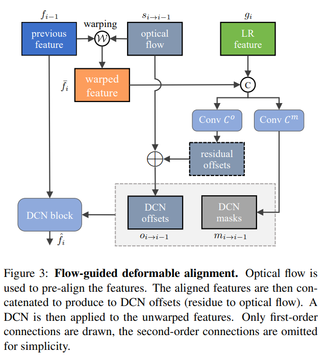

# VSR实现方案总结

论文|发表于|主要思想|输入输出模式|对齐方式
-|-|-|-|-
Video Super-Resolution with Recurrent Structure-Detail Network|CVPR2020|高频分量(Detail)和低频分量(Structure)分开计算|RNN结构|动态卷积
MuCAN: Multi-correspondence Aggregation Network for Video Super-Resolution|ECCV2020|聚合多个尺度上的信息|输入3帧输出1帧|在一定范围内搜索相似图像块、不完整的动态卷积
BasicVSR: The Search for Essential Components in Video Super-Resolution and Beyond|CVPR2021|验证现有的各种网络结构对VSR任务的影响，并进而找到了一种SOTA方案|RNN结构|光流
BasicVSR论文中介绍的IconVSR|CVPR2021|在BasicVSR使用关键帧补充信息|RNN结构|光流
BasicVSR++: Improving Video Super-Resolution with Enhanced Propagation and Alignment|NTIRE2021|二阶网状传播、光流引导的可形变卷积对齐|RNN结构|光流、可形变卷积

## Video Super-Resolution with Recurrent Structure-Detail Network

输入部分：
* 从当前帧$I_{t}^{L}$和上一帧$I_{t-1}^{L}$中提取高频分量$D_{t}^{LR}$、$D_{t-1}^{LR}$和低频分量$S_{t}^{LR}$、$S_{t-1}^{LR}$
* 高频分量的分支：
  * 拼接$D_{t}^{LR}$、$D_{t-1}^{LR}$、上一帧的隐藏层输出$h_{t-1}^{SD}$经过隐藏状态自适应处理(Hidden-state Adaption)后的输出$\hat h_{t-1}^{SD}$和上一帧的高频分量预测值$\hat D_{t-1}$
  * 经过一个卷积和ReLU

SD-Block长这样：

主要是为了让高低频的处理过程有交互

上面说的隐藏状态自适应处理(Hidden-state Adaption)实际上就是基于动态卷积的特征对齐：

## MuCAN: Multi-correspondence Aggregation Network for Video Super-Resolution

* 相邻帧先经过TM-CAM在不同尺度下寻找前后帧间的相似图块
* 然后在经过CN-CAM在不同尺度下寻找特征图内的相似图块

TM-CAM：
* 先将输入帧缩放为不同大小（尺度）
* 在每个尺度上进行操作：
  * 对于当前帧的某一尺度，在临近帧的同一尺度的附近区域寻找最相似的K个图块
  * 将这K+1个图块拼在一起
  * 对于当前帧的某一尺度，与临近帧的同一尺度计算动态卷积核
  * 对当前帧进行动态卷积
  * 动态卷积结果与当前帧当前位置的当前图块进行内积
* 每个尺度计算完之后进行上采样，与下一个尺度的原图一起输入

CN-CAM：
* 对TM-CAM的输出进行均值下采样缩放为不同大小（尺度）
* 对每一个尺度，都从下一个尺度中取出最相似的图块
* 经过自注意力
* 拼接后卷积

## BasicVSR: The Search for Essential Components in Video Super-Resolution and Beyond

* 双向RNN
* RNN单元内部：
  * 用当前帧$x_i$和前一帧$x_{i-1}$(或是后一帧$x_{i+1}$)计算光流
  * 借助光流对前一帧的隐藏层输出$h^f_{i-1}$(或是后一帧的隐藏层输出$h^b_{i+1}$)进行特征对齐
  * 将对齐后的特征与原图进行ResBlock计算，得到$h^f_{i}$和$h^b_{i}$
* $h^f_{i}$和$h^b_{i}$拼接后进行Upsample得到高清输出

## BasicVSR论文中介绍的IconVSR

* 在特征对齐后加一个步骤，在关键帧处把前后帧的特征混入$h^f_{i}$和$h^b_{i}$中
* 正向RNN以反向RNN的输出作为输入

具体怎么混入：在关键帧处从前后帧和当前帧中提取特征然后与$h^f_{i}$和$h^b_{i}$进行卷积，非关键帧处不变

## BasicVSR++: Improving Video Super-Resolution with Enhanced Propagation and Alignment

* 双向传播叠四层
* 在传播中跨一级连接
* 在每一个传播模块中：
  * 对之前的输出进行光流引导的可形变卷积
  * 与当前输入进行拼接
  * 经过一堆卷积和ReLU
* 最后输出的高清残差是输出特征的PixelShuffle
* 高清残差与原图上采样结果相加

* 二阶网状传播为何有效：从更多的地方获取信息
* 光流引导的可形变卷积为何有效：从临近区域的特征中提取信息，帮助恢复细节

光流引导的可形变卷积：
* 以光流为可形变卷积偏置量的基础值
* 训练可形变卷积偏置量在基础值上增加的残差

这样可以保证训练的稳定性

