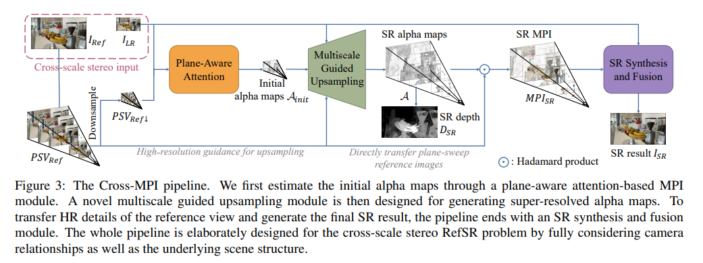
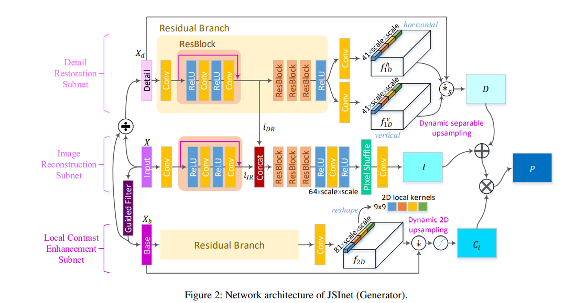

# 没看懂的论文杂记

## Cross-MPI: Cross-scale Stereo for Image Super-Resolution using Multiplane Images

* reference-based super-resolution (RefSR) 用低清图加一张参考图进行超分辨率操作，相当于要把参考图上的细节迁移到低清图上生成高清图
* multiplane image (MPI) representation 指一张图可以由远近不同距离上的多张平面叠合而成

本文就是用一种种多平面敏感的注意力机制CNN进行RefSR

## JSI-GAN: GAN-Based Joint Super-Resolution and Inverse Tone-Mapping with Pixel-Wise Task-Specific Filters for UHD HDR Video

在进行图像超分辨率时，将三个子任务分别用三个不同的模型完成：
* image reconstruction 图像重建
* detail restoration (DR) 细节重建
* local contrast enhancement (LCE) 对比度强化

## MetaSCI: Scalable and Adaptive Reconstruction for Video Compressive Sensing

SCI说的是snapshot compressive imaging，快照压缩成像，是指使用2D检测器在快照测量中捕获HD（≥3D）数据。通过新颖的光学设计，二维检测器以压缩方式对高清数据进行采样；此后，采用算法来重建所需的高清数据立方体。SCI已用于高光谱成像，视频，全息，断层扫描，焦深成像，偏振成像，显微镜等。

快照压缩成像是压缩感知的一种，相关知识见[《压缩感知（Compressed Sensing）科普》](../图像处理/压缩感知.md)

本文把SCI搭配上CNN用在了高速帧成像中
