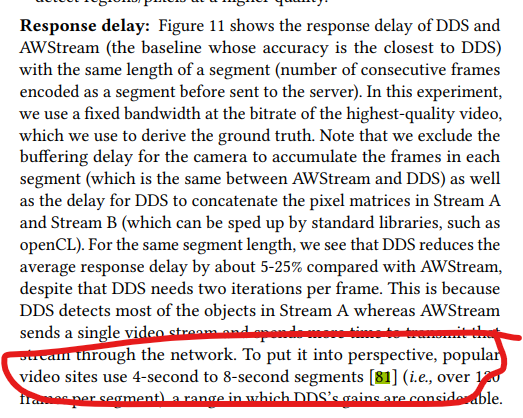
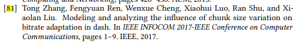
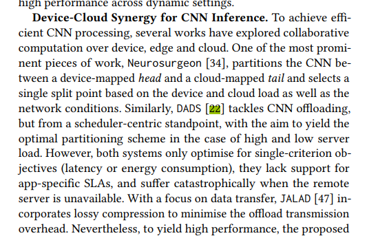
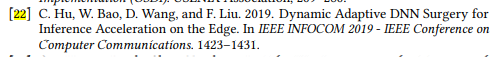
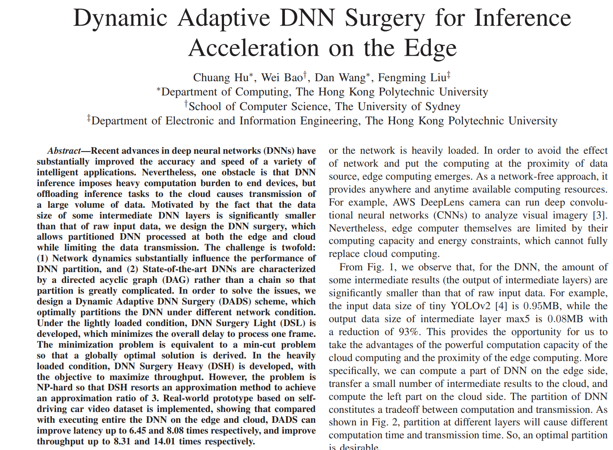
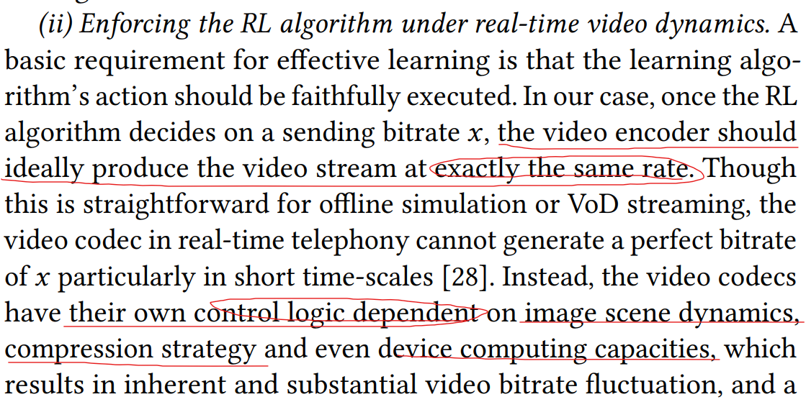

# 讨论内容

## SIGCOM中的论文其优点何在？

在一个使用场景中开辟了新思路，并且效果很好，这是决定性因素么？

### 论文的思想都很巧妙很好理解，但学术性从何体现？应该重点关注哪些部分？

## SIGCOMM读到论文里面的里面引用的INFOCOMM

### 来自 Server-Driven Video Streaming for Deep Learning Inference 的

### 来自 SPINN 的 Related Work

## 开题中想到的问题

实际的应用场景都是论文里自己找的？

应用场景应该如何寻找？

比如车联网的开题，现在都倾向于把目标识别自动驾驶放在车上而不是网络上，并且不是因为性能上的考虑，而是人命关天，容不得任何延迟，通过网络做不仅是有延迟不能及时反应并且有安全问题，并且显卡的体积能耗热量都只是汽车发动机的零头，不大会有算力不够的说法，可以做但是做出了不太可能被厂商接受。并且这种联合感觉非常牵强，要深究可以有很多在边缘服务器上运行的不相干的问题都可以联合。

论文只能告诉我们什么可以做，但不能告诉我们什么不能做：
* 有哪些东西是已经有人探索过并证明不可行的方向？人总是只会在可行的方向上发论文
* 不可行的方向看着和可行但没人做的方向很像
* 不可行的方向要从历史中去判断，并且可行与不可行随科学发展还会发生变化

## 论文中随处可见要实际上手做过才能想到的问题

现在在干的项目中有哪些可以实践的方面？

不能一直拿数据集搞事，数据集不符合任何一种目标检测的应用场景（典型地，摄像头的目标识别都是连续视频，更数据集区别挺大）

### 来自OnRL: improving mobile video telephony via online reinforcement learning

用强化学习控制在线视频聊天的码率。

这里作者想到了码率不能说变就变，视频编码受多种因素影响

还有这里作者连训练初期出现错误行为对网络的影响都考虑了。单从科研角度来讲，这个问题不容易想得到。

### SPINN

关于这个SPINN也是一样，我看着里面提到的很多问题都看不出来它为什么提，明明相关的问题应该很多，偏偏提了那一个

不实际上手ResNet之类的网络提不出来这样的问题

## 总结项

* 应用场景
* 要解决的核心问题
* 用于此场景的现有技术
* 这个应用场景和其他应用场景的不同之处
* 要解决的关键问题
* 解决这些关键问题的方法
* 可调参数

## 杂项

边缘计算工作流->依赖性的镜像缓存

运用了某种方法->这个应用场景和这个方法的其他应用场景有啥不一样的？
