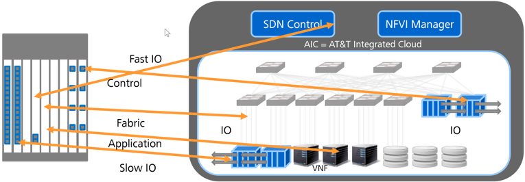
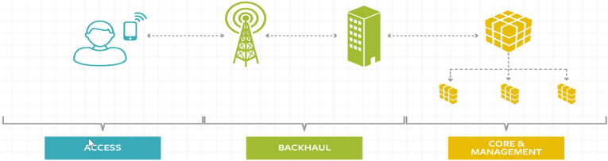
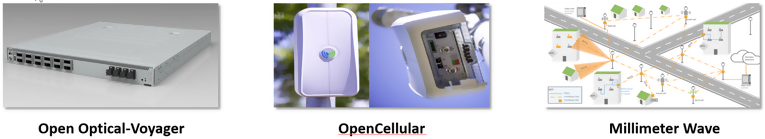

# CORD

[OCP/TIP/CORD能颠覆电信设备商吗？ 华为高人看透了本质](https://www.sdnlab.com/22530.html)

## OCP历史

### 2005/2006年的Google：数据中心代工自用

2005/2006年，谷歌意识到面向企业IT的传统数据中心架构难以满足其纷繁复杂的应用需求和波涛汹涌的业务流量的时候，谷歌从硅谷各个公司挖掘了一支经验丰富的设计开发团队，开始了数据中心自己设计、代工制造、自己建设、自己使用的不归路。而且，随后不久，谷歌就把整个软硬件基础设施的重要性放到了公司战略的最核心地位之一。但是，谷歌在很长时间内，对其数据中心内部架构和软硬件构成都严守秘密，从来不对外面揭示里面的细节。

### 2011年的Facebook：开源数据中心设计方案

作为一个纯互联网应用公司的创始人，扎克伯格始终认为设计和研制数据中心硬件基础不是公司的业务核心，其巨大的采购和运营成本也有很多可以降低的空间。更何况理顺服务器，存储器、交换机和上面各种管理和平台软件，中间纷繁复杂的细节牵扯了公司许多宝贵的工程资源。不过很长时间，没有人帮他把这个想法阐述清楚，并且展开和实施。

2011年4月，扎克伯格决定把Facebook的数据中心设计方案贡献出去，开源发展，OCP-Open Computing Project组织成立，并且开始了高速增长、翻天覆地之路。

### OCP

OCP以数据中心基础硬件为重点，兼顾少量相应的平台管理软件。这是一个非常详尽和完备的数据中心硬件开源项目，不但对数据中心传统的计算、交换、存储等硬件进行了开源，而且深入到了机架、电源等，零零总总包含了运营一个数据中心的方方面面。开发采用快速迭代的方式，关键硬件在短短几年之内已经更新几代了。项目的许可证（license）相当的开放，成员可以很方便地拿到从设计图，到工程图，到源代码的端到端技术实现。

OCP的整个项目思路，是建立在两个关键理念之上：
1. 开源(Open Source)
2. 解构(Dis-aggregation)。

开源不用多解释。这里他们做的独特一点是把开源License从软件进一步引到了硬件上面。解构在OCP这里有两个含义：
1. 软件和硬件的解耦。
2. 硬件系统之间各层的解构（芯片的相互替代，界面之间的Interop等）。

## CORD(Central Office Re-architected as Datacenter)

CORD名字本身就非常直白的说明了自己要干的事情：把CO站点用数据中心的方式来改造一遍。和OCP一样，数据中心又是重点。

这里数据中心是指：

1. 网络功能和控制管理平台用SDN/NFV和各种云技术来构成。
2. CO站点里面的通信硬件被解构，大量运用数据中心现有硬件和少量通信专用的IO接口板来搭建。

如下图所示，将运营商的CO映射为数据中心

CORD的核心就是用IT/互联网运营商的技术思路/运维方法来解决电信运营商的技术、商业、管理、运维等问题。用开源软件和白牌硬件来构建技术模块，用通用的数据中心基础设施规模来降低成本。CORD主要架构师坚信：不改变设备硬件形态的网络虚拟化都不是真正的虚拟化，不是真正的云化，也不是架构性的变革。通过这样的变革，他们希望达到互联网公司的敏捷，同时创造高效的业务。

### 运营商为什么需要CORD？

面对网络流量的指数增长，不在CO站点做文章，只是通过加粗管道的方法来应付，太被动。数据中心的软硬件架构已经被OTT证明可以非常好的Scale-up和Scale-Out，而且可以更简单更方便地使用CDN等技术来解决流量问题。

## TIP(Telecom Infra Project)

TIP是Facebook对OCP的延申，分接入、回传和核心网/管理三个领域，基本上覆盖了电信网络的核心领域。

接入领域有5个项目：1. Edge Computing. 2. Open Cellular, 3. System Integration and Site Optimization, 4. Solutions Integration, 5. vRAN Fronthaul. 回传有两个项目：1. Open Optical Transport Network, 2. Millimeter Wave Network. 核心网/管理有三个项目： 1. People and Process, 2. Core Network Optimization. 3. Greenfield Telecom Networks

从项目的覆盖来看，TIP以无线接入为主要应用场景，对整个运营商的网络进行了端到端的覆盖。发布的硬件都是以现有硬件为基础，快速改造移植过来的:

1. Voyager是Facebook Wedge100数据中心交换机加上彩光接口改造的。
2. OpenCellular以Cavium的小站芯片组为基础，加上计算模块。
3. Millimeter Wave更是把Facebook自己在Connectivity Lab的Teragraph项目直接贡献了出来。目前Voyager和OpenCellular都有运营商在测试。微波这次在九月份的旧金山GSMA大会上刚刚发布，已经在硅谷实地部署测试。最近，Facebook和德国电信宣布用60G毫米波进行无线城市多点接入和传输，德电的CTO Bruno Jacobfeuerborn宣称，我们不仅要连接未连接的地区，TIP还要在密集城区里做无线。