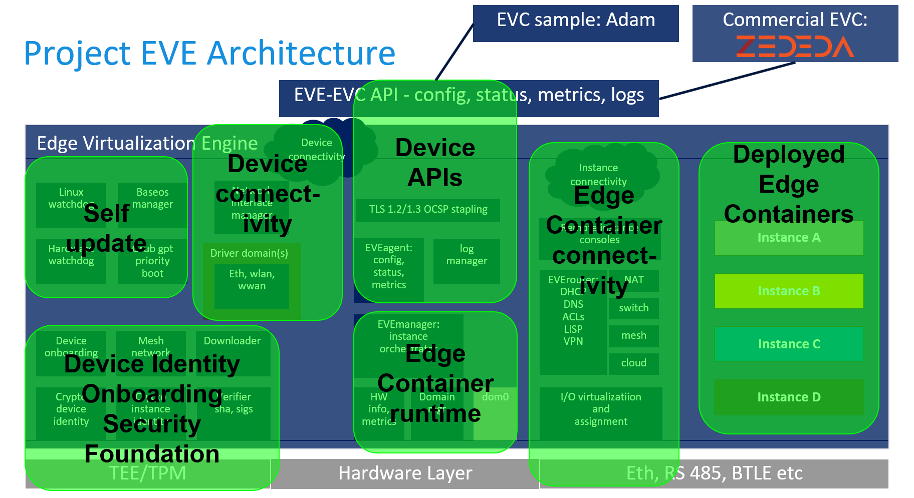

# EVE (Edge Virtualization Engine)

## 层次

### Type-1 hypervisor

* EVE底层是一个基于Xen虚拟机的Type-1 hypervisor
* 可以在边缘设备上运行多种操作系统，是其边缘化的基础
* 因为是虚拟机，所以可以运行任何边缘计算框架，包括EdgeX Foundry, Fledge, Azure IoT Edge, AWS Greengrass Core等
* 因为是虚拟机，所以隔离性好，安全性高

### Device connectivity and management interfaces

通过网络接口连接EVE中的应用（虚拟机）

* device network interface
* drivers for ethernet and wireless networking
* an API for connecting EVE to centralized management services

### Operating system services

a hardened root-of-trust operating system

为EVE中的应用提供以下功能：

* self update
* identity management：身份验证
* security：安全（主要指内存隔离和内存/存储加密）
* networking services

### Edge container runtime

容器运行控制/容器编排工具

* domain management：域控制
* instance orchestration：实例编排
* virtualized IO
* inter instance networking：实例间的动态联网
* remote instance consoles

## 架构

### Device Identity Onboarding and Security Foundation

* 设备以公钥为ID (as X.509 certificate)
  * Generated by the TPM (trusted platform module) if available
* 启动时扫描序列号
  * User adds serial number (plus onboarding token) to controller
  * Device will attempt to register its device cert on first boot
* 设备私钥用于磁盘加密、远程认证等
* 理想情况是设备公私钥在制造时即写入，用户在购买设备时收到一个证书才能在设备上编程

### Self Update

* Update all of EVE including hypervisor
* 处理错误
  * Power failure when writing to flash
  * Bad new EVE image resulting in not being able to connect to controller
  * checking image signature
* Option for user to commit to new EVE version (未完成)
* ???Implemented using dual partitions, hardware and software watchdog
* ???Currently using grub for fallback booting; being generalized
* ???使用GBT（GUID分区表）

### Device connectivity

* 设备必须与控制器相连
  * 控制器控制容器启停
  * 设备必须与控制器的连接可以冗余
* 容器间连接默认使用DHCP，可以设置静态IP
* 可以设置HTTP代理
* 网络设置可以由控制器进行修改

### EVE Device API

所有API均由ProtoBuf定义，TLS传输

方法|接口URL|功能
:-|:-|:-
POST|api/v1/edgedevice/register|设备注册
GET|api/v1/edgedevice/ping|for connectivity test
GET|api/v1/edgedevice/config|for complete device + instance config
POST|api/v1/edgedevice/info|for triggered device/instance status
POST|api/v1/edgedevice/metrics|设备定期上报状态
POST|api/v1/edgedevice/logs|for logs from microservices on device
POST|api/v1/edgedevice/flowlog|for ECO network flows logs

### Edge Container runtime

* 基于Xen虚拟化
* 可以直接运行Docker容器（基于rkt）
* 提供一套设置容器连接的工具链

#### What is an "edge container"?
Edge containers are virtual machines with a manifest that describes the runtime environment including device resource and connectivity requirements.

##### Edge Container Image (ECI)

类比docker Image，是EVE容器的模板，支持传统VMs, OCI/docker Image格式和Unikernels

###### Can I use Docker containers with EVE?
You can run a virtual machine with Linux that runs Docker Install within it.

##### Edge Container Object (ECO)

类比由docker Image生成的docker Container，是由ECI生成的运行容器

### Edge Container Connectivity

* 默认通过NAT
* 可以设置USB或者COM口连接
* 可以设置交换网络
* 可以设置云网络连接到AWS VPN或者Azure VPN等
* 可以设置mesh network实现Edge-to-Edge连接